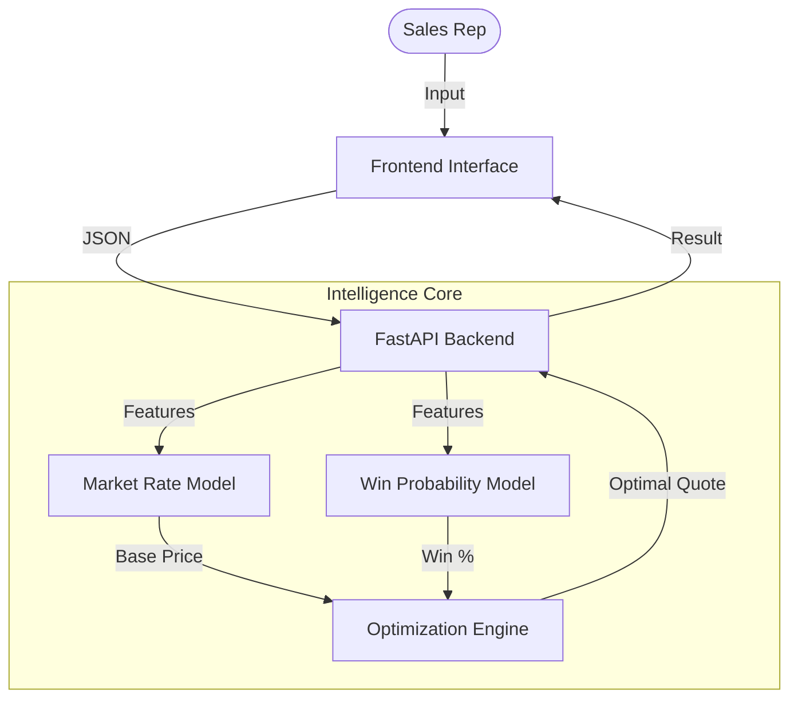

# Quote Genie 

> **Predictive Pricing Intelligence Engine (PPIE)**  
> *Data-Driven Decisions. Optimized Margins. Winning Quotes.*

---

**Quote Genie** transforms the manual quoting process into an intelligent, data-driven workflow. By leveraging advanced machine learning, it predicts optimal price points in real-time to balance **win probability** with **profit margins**. 

---

##  System Overview

The engine operates on a sophisticated **Dual-Model Architecture**:

1.  **Price Optimization** (XGBRegressor): "What is the fair market rate?"
2.  **Win Probability** (XGBClassifier): "What is the chance of winning at this price?"

###  End-to-End Flow


---

##  Key Features

*   ** Real-Time Intelligence**: Get instant price recommendations based on live parameters (Weight, Volume, Route).
*   ** Dual-Model ML**: Combines regression (price) and classification (win chance) for holistic decision making.
*   ** Simplicity Design**: A clean, minimalist interface focused on clarity and speed.
*   ** Explainable AI**: Understand *why* a price was recommended (e.g., "High Demand Route", "Heavy Payload").

---

## 🛠️ Technology Stack

| Component | Tech | Description |
| :--- | :--- | :--- |
| **Frontend** | React + Vite | Fast, modern, minimalist UI |
| **Backend** | FastAPI (Python) | High-performance async API |
| **ML Core** | XGBoost / Scikit-Learn | Gradient boosting for tabular data |
| **Data** | Pandas / NumPy | Data processing & synthetic generation |

---

## 🏁 Quick Start

### 1. Backend & ML Setup
Train the AI models and start the API server.
```bash
# 1. Install Dependencies
pip install scikit-learn xgboost pandas numpy joblib fastapi uvicorn python-multipart

# 2. Train Models (Generate synthetic data first)
cd ml_engine
python generate_data.py
python train_model.py

# 3. Start Backend
cd ../backend
uvicorn main:app --reload
```
*API runs at: `http://localhost:8000`*

### 2. Frontend Setup
Launch the user interface.
```bash
cd frontend
npm install
npm run dev
```
*UI runs at: `http://localhost:5173`*

---

## 📂 Repository Structure

```
Quote_Genie/
├── 🧠 ml_engine/        # Training pipelines & Data generators
├── 🔌 backend/          # FastAPI server & Model inference
├── 💻 frontend/         # React application
└── 📄 docs/             # Planning & Architecture documents
```

---

## 🤝 Contributing

We welcome contributions! Please see [CONTRIBUTING.md](CONTRIBUTING.md) for details on how to submit pull requests, report issues, and follow our coding standards.

---
*Built for the Future of Logistics Pricing.*
